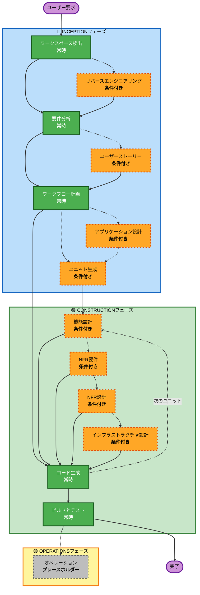

# AI-DLC適応型ワークフロー概要

**目的**：AIモデルと開発者が完全なワークフロー構造を理解するための技術的な参考資料。

**注意**：類似のコンテンツがcore-workflow.md（ユーザーウェルカムメッセージ）とREADME.md（ドキュメント）に存在します。この重複は意図的です - 各ファイルは異なる目的を果たします：
- **このファイル**：AIモデルのコンテキスト読み込みのためのMermaid図を含む詳細な技術参照
- **core-workflow.md**：ASCII図を含むユーザー向けウェルカムメッセージ
- **README.md**：リポジトリのための人間が読める形式のドキュメント

## 3フェーズのライフサイクル：
• **INCEPTIONフェーズ**：計画とアーキテクチャ（ワークスペース検出+条件付きフェーズ+ワークフロー計画）
• **CONSTRUCTIONフェーズ**：設計、実装、ビルドとテスト（ユニットごとの設計+コード計画/生成+ビルド＆テスト）
• **OPERATIONSフェーズ**：将来のデプロイメントとモニタリングワークフローのプレースホルダー

## 適応型ワークフロー：
• **ワークスペース検出**（常時）→ **リバースエンジニアリング**（ブラウンフィールドのみ）→ **要件分析**（常時、適応的な深度）→ **条件付きフェーズ**（必要に応じて）→ **ワークフロー計画**（常時）→ **コード生成**（常時、ユニットごと）→ **ビルドとテスト**（常時）

## 仕組み：
• **AIが分析**：あなたの要求、ワークスペース、複雑さを分析して、どのステージが必要かを決定
• **これらのステージは常に実行**：ワークスペース検出、要件分析（適応的な深度）、ワークフロー計画、コード生成（ユニットごと）、ビルドとテスト
• **その他のステージはすべて条件付き**：リバースエンジニアリング、ユーザーストーリー、アプリケーション設計、ユニット生成、ユニットごとの設計ステージ（機能設計、NFR要件、NFR設計、インフラストラクチャ設計）
• **固定シーケンスなし**：ステージは、特定のタスクに適した順序で実行される

## チームの役割：
• **質問に答える**：[Answer]:タグと文字の選択肢（A、B、C、D、E）を使用して専用の質問ファイルで
• **オプションEが利用可能**：提供されたオプションが一致しない場合は「その他」を選択してカスタム応答を説明
• **チームとして作業**：各フェーズを進める前に確認と承認
• **共同で決定**：必要に応じてアーキテクチャアプローチについて
• **重要**：これはチームの取り組みです - 各フェーズに関連する関係者を含める

## AI-DLC 3フェーズワークフロー：

**ステージの説明:**

**🔵 INCEPTIONフェーズ** - 計画とアーキテクチャ
- ワークスペース検出：ワークスペースの状態とプロジェクトタイプを分析（常時）
- リバースエンジニアリング：既存のコードベースを分析（条件付き - ブラウンフィールドのみ）
- 要件分析：要件を収集して検証（常時 - 適応的な深度）
- ユーザーストーリー：ユーザーストーリーとペルソナを作成（条件付き）
- ワークフロー計画：実行計画を作成（常時）
- アプリケーション設計：高レベルのコンポーネント識別とサービス層設計（条件付き）
- ユニット生成：作業単位に分解（条件付き）

**🟢 CONSTRUCTIONフェーズ** - 設計、実装、ビルドとテスト
- 機能設計：ユニットごとの詳細なビジネスロジック設計（条件付き、ユニットごと）
- NFR要件：NFRを決定し、技術スタックを選択（条件付き、ユニットごと）
- NFR設計：NFRパターンと論理コンポーネントを組み込む（条件付き、ユニットごと）
- インフラストラクチャ設計：実際のインフラストラクチャサービスにマッピング（条件付き、ユニットごと）
- コード生成：パート1 - 計画、パート2 - 生成でコードを生成（常時、ユニットごと）
- ビルドとテスト：すべてのユニットをビルドして包括的なテストを実行（常時）

**🟡 OPERATIONSフェーズ** - プレースホルダー
- オペレーション：将来のデプロイメントとモニタリングワークフローのプレースホルダー（プレースホルダー）

**主要原則：**
- フェーズは価値を追加する場合にのみ実行
- 各フェーズは独立して評価
- INCEPTIONは「何を」と「なぜ」に焦点
- CONSTRUCTIONは「どのように」に加えて「ビルドとテスト」に焦点
- OPERATIONSは将来の拡張のためのプレースホルダー
- シンプルな変更は条件付きINCEPTIONステージをスキップする可能性がある
- 複雑な変更は完全なINCEPTIONとCONSTRUCTIONの処理を受ける
