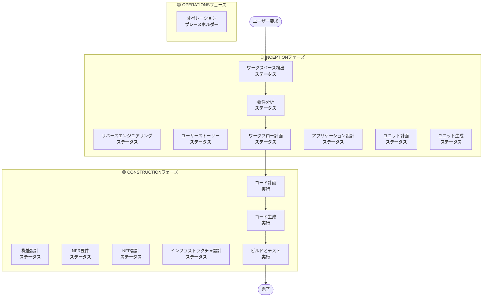

# ワークフロー計画

**目的**：実行するフェーズを決定し、包括的な実行計画を作成する

**常に実行**：このフェーズは要件とスコープを理解した後に常に実行されます

## ステップ1：すべての以前のコンテキストを読み込む

### 1.1 リバースエンジニアリング成果物を読み込む（ブラウンフィールドの場合）
- architecture.md
- component-inventory.md
- technology-stack.md
- dependencies.md

### 1.2 要件分析を読み込む
- requirements.md（意図分析を含む）
- requirement-verification-questions.md（回答付き）

### 1.3 ユーザーストーリーを読み込む（実行された場合）
- stories.md
- personas.md

## ステップ2：詳細なスコープと影響の分析

**完全なコンテキスト（要件+ストーリー）があるので、詳細な分析を実行：**

### 2.1 変換スコープ検出（ブラウンフィールドのみ）

**ブラウンフィールドプロジェクトの場合**、変換スコープを分析：

#### アーキテクチャ変換
- **単一コンポーネントの変更**対**アーキテクチャ変換**
- **インフラストラクチャの変更**対**アプリケーションの変更**
- **デプロイメントモデルの変更**（Lambda→コンテナ、EC2→サーバーレスなど）

#### 関連コンポーネントの識別
変換の場合、以下を識別：
- 更新が必要な**インフラストラクチャコード**
- 変更を必要とする**CDKスタック**
- **APIゲートウェイ**設定
- **ロードバランサー**要件
- 必要な**ネットワーキング**の変更
- **モニタリング/ロギング**の適応

#### クロスパッケージへの影響
- 更新が必要な**CDKインフラストラクチャ**パッケージ
- バージョン更新が必要な**共有モデル**
- エンドポイント変更が必要な**クライアントライブラリ**
- 新しいテストシナリオが必要な**テストパッケージ**

### 2.2 変更影響評価

#### 影響領域
1. **ユーザー向けの変更**：これはユーザーエクスペリエンスに影響しますか？
2. **構造的変更**：これはシステムアーキテクチャを変更しますか？
3. **データモデルの変更**：これはデータベーススキーマまたはデータ構造に影響しますか？
4. **APIの変更**：これはインターフェースまたは契約に影響しますか？
5. **NFRへの影響**：これはパフォーマンス、セキュリティ、またはスケーラビリティに影響しますか？

#### アプリケーション層への影響（該当する場合）
- **コード変更**：新しいエントリーポイント、アダプター、設定
- **依存関係**：新しいライブラリ、フレームワークの変更
- **設定**：環境変数、設定ファイル
- **テスト**：ユニットテスト、統合テスト

#### インフラストラクチャ層への影響（該当する場合）
- **デプロイメントモデル**：Lambda→ECS、EC2→Fargateなど
- **ネットワーキング**：VPC、セキュリティグループ、ロードバランサー
- **ストレージ**：永続ボリューム、共有ストレージ
- **スケーリング**：オートスケーリングポリシー、容量計画

#### 運用層への影響（該当する場合）
- **モニタリング**：CloudWatch、カスタムメトリクス、ダッシュボード
- **ロギング**：ログ集約、構造化ロギング
- **アラート**：アラーム設定、通知チャネル
- **デプロイメント**：CI/CDパイプラインの変更、ロールバック戦略

### 2.3 コンポーネント関係マッピング（ブラウンフィールドのみ）

**ブラウンフィールドプロジェクトの場合**、コンポーネント依存関係グラフを作成：

```markdown
## コンポーネント関係
- **主要コンポーネント**：[変更されるパッケージ]
- **インフラストラクチャコンポーネント**：[CDK/Terraformパッケージ]
- **共有コンポーネント**：[モデル、ユーティリティ、クライアント]
- **依存コンポーネント**：[このコンポーネントを呼び出すサービス]
- **サポートコンポーネント**：[モニタリング、ロギング、デプロイメント]
```

各関連コンポーネントについて：
- **変更タイプ**：メジャー、マイナー、設定のみ
- **変更理由**：直接依存、デプロイメントモデル、ネットワーキング
- **変更優先度**：重要、重要、オプション

### 2.4 リスク評価

リスクレベルを評価：
1. **低**：孤立した変更、ロールバックが簡単、よく理解されている
2. **中**：複数のコンポーネント、中程度のロールバック、いくつかの未知数
3. **高**：システム全体への影響、複雑なロールバック、重要な未知数
4. **重大**：本番環境で重要、困難なロールバック、高い不確実性

## ステップ3：フェーズの決定

### 3.1 ユーザーストーリー - すでに実行済みまたはスキップ？
**すでに実行済み**：次の決定に移る
**実行されていない - 次の場合に実行**：
- 複数のユーザーペルソナ
- ユーザーエクスペリエンスへの影響
- 受け入れ基準が必要
- チームコラボレーションが必要

**次の場合にスキップ**：
- 内部リファクタリング
- 明確な再現を持つバグ修正
- 技術的負債の削減
- インフラストラクチャの変更

### 3.2 アプリケーション設計 - 次の場合に実行：
- 新しいコンポーネントまたはサービスが必要
- コンポーネントメソッドとビジネスルールの定義が必要
- サービス層の設計が必要
- コンポーネント依存関係の明確化が必要

**次の場合にスキップ**：
- 既存のコンポーネント境界内の変更
- 新しいコンポーネントまたはメソッドがない
- 純粋な実装変更

### 3.3 設計（ユニット計画/生成） - 次の場合に実行：
- 新しいデータモデルまたはスキーマ
- APIの変更または新しいエンドポイント
- 複雑なアルゴリズムまたはビジネスロジック
- 状態管理の変更
- 複数のパッケージに変更が必要
- Infrastructure-as-codeの更新が必要

**次の場合にスキップ**：
- シンプルなロジック変更
- UIのみの変更
- 設定の更新
- 単純な実装

### 3.4 NFR実装 - 次の場合に実行：
- パフォーマンス要件
- セキュリティの考慮事項
- スケーラビリティの懸念
- モニタリング/可観測性が必要

**次の場合にスキップ**：
- 既存のNFRセットアップで十分
- 新しいNFR要件がない
- NFRへの影響がないシンプルな変更

## ステップ4：適応的詳細を注記

**適応的な深度の説明については、[depth-levels.md](../common/depth-levels.md)を参照してください**

実行される各ステージについて：
- 定義されたすべての成果物が作成される
- 成果物内の詳細レベルは問題の複雑さに適応
- モデルが問題の特性に基づいて適切な詳細を決定

## ステップ5：マルチモジュール調整分析（ブラウンフィールドのみ）

**複数のモジュール/パッケージを持つブラウンフィールドの場合**、依存関係を分析して最適な更新戦略を決定：

### 5.1 モジュール依存関係を分析
- ビルドシステムの依存関係と依存関係マニフェストを調査
- ビルド時対ランタイムの依存関係を識別
- モジュール間のAPI契約と共有インターフェースをマッピング

### 5.2 更新戦略を決定
依存関係分析に基づいて決定：
- **更新シーケンス**：依存関係のために最初に更新する必要があるモジュール
- **並列化の機会**：同時に更新できるモジュール
- **調整要件**：バージョン互換性、API契約、デプロイメント順序
- **テスト戦略**：モジュールごと対統合テストアプローチ
- **ロールバック戦略**：シーケンス中の失敗が発生した場合の復旧計画

### 5.3 調整計画を文書化
```markdown
## モジュール更新戦略
- **更新アプローチ**：[順次/並列/ハイブリッド]
- **クリティカルパス**：[他の更新をブロックするモジュール]
- **調整ポイント**：[共有API、インフラストラクチャ、データ契約]
- **テストチェックポイント**：[統合を検証するタイミング]
```

影響を受ける各モジュールについて識別：
- **更新優先度**：最初に更新する必要がある対後で更新できる
- **依存関係制約**：それが依存するもの、それに依存するもの
- **変更スコープ**：メジャー（破壊的）、マイナー（互換性あり）、パッチ（修正）

## ステップ6：ワークフロー視覚化を生成

以下を示すMermaidフローチャートを作成：
- すべてのフェーズを順番に
- 各条件付きフェーズのEXECUTEまたはSKIP決定
- 各フェーズ状態の適切なスタイリング

**スタイリングルール**（フローチャートの後に追加）：
```
style WD fill:#4CAF50,stroke:#1B5E20,stroke-width:3px,color:#fff
style CP fill:#4CAF50,stroke:#1B5E20,stroke-width:3px,color:#fff
style CG fill:#4CAF50,stroke:#1B5E20,stroke-width:3px,color:#fff
style BT fill:#4CAF50,stroke:#1B5E20,stroke-width:3px,color:#fff
style US fill:#BDBDBD,stroke:#424242,stroke-width:2px,stroke-dasharray: 5 5,color:#000
style Start fill:#CE93D8,stroke:#6A1B9A,stroke-width:3px,color:#000
style End fill:#CE93D8,stroke:#6A1B9A,stroke-width:3px,color:#000

linkStyle default stroke:#333,stroke-width:2px
```

**スタイルガイドライン**：
- 完了/常時実行：`fill:#4CAF50,stroke:#1B5E20,stroke-width:3px,color:#fff`（マテリアルグリーンと白テキスト）
- 条件付きEXECUTE：`fill:#FFA726,stroke:#E65100,stroke-width:3px,stroke-dasharray: 5 5,color:#000`（マテリアルオレンジと黒テキスト）
- 条件付きSKIP：`fill:#BDBDBD,stroke:#424242,stroke-width:2px,stroke-dasharray: 5 5,color:#000`（マテリアルグレーと黒テキスト）
- 開始/終了：`fill:#CE93D8,stroke:#6A1B9A,stroke-width:3px,color:#000`（マテリアルパープルと黒テキスト）
- フェーズコンテナ：明るいマテリアルカラーを使用（INCEPTION：#BBDEFB、CONSTRUCTION：#C8E6C9、OPERATIONS：#FFF59D）

## ステップ7：実行計画ドキュメントを作成

`aidlc-docs/inception/plans/execution-plan.md`を作成：

```markdown
# 実行計画

## 詳細な分析サマリー

### 変換スコープ（ブラウンフィールドのみ）
- **変換タイプ**：[単一コンポーネント/アーキテクチャ/インフラストラクチャ]
- **主要な変更**：[説明]
- **関連コンポーネント**：[リスト]

### 変更影響評価
- **ユーザー向けの変更**：[はい/いいえ - 説明]
- **構造的変更**：[はい/いいえ - 説明]
- **データモデルの変更**：[はい/いいえ - 説明]
- **APIの変更**：[はい/いいえ - 説明]
- **NFRへの影響**：[はい/いいえ - 説明]

### コンポーネント関係（ブラウンフィールドのみ）
[コンポーネント依存関係グラフ]

### リスク評価
- **リスクレベル**：[低/中/高/重大]
- **ロールバックの複雑さ**：[簡単/中程度/困難]
- **テストの複雑さ**：[シンプル/中程度/複雑]

## ワークフロー視覚化



**注意**：ステータスプレースホルダーを実際のフェーズステータス（COMPLETED/SKIP/EXECUTE）に置き換え、適切なスタイリングを適用

## 実行するフェーズ

### 🔵 INCEPTIONフェーズ
- [x] ワークスペース検出（完了）
- [x] リバースエンジニアリング（完了/スキップ）
- [x] 要件詳細化（完了）
- [x] ユーザーストーリー（完了/スキップ）
- [x] 実行計画（進行中）
- [ ] アプリケーション設計 - [実行/スキップ]
  - **理由**：[実行またはスキップの理由]
- [ ] ユニット計画 - [実行/スキップ]
  - **理由**：[実行またはスキップの理由]
- [ ] ユニット生成 - [実行/スキップ]
  - **理由**：[実行またはスキップの理由]

### 🟢 CONSTRUCTIONフェーズ
- [ ] 機能設計 - [実行/スキップ]
  - **理由**：[実行またはスキップの理由]
- [ ] NFR要件 - [実行/スキップ]
  - **理由**：[実行またはスキップの理由]
- [ ] NFR設計 - [実行/スキップ]
  - **理由**：[実行またはスキップの理由]
- [ ] インフラストラクチャ設計 - [実行/スキップ]
  - **理由**：[実行またはスキップの理由]
- [ ] コード計画 - 実行（常時）
  - **理由**：実装アプローチが必要
- [ ] コード生成 - 実行（常時）
  - **理由**：コード実装が必要
- [ ] ビルドとテスト - 実行（常時）
  - **理由**：ビルド、テスト、検証が必要

### 🟡 OPERATIONSフェーズ
- [ ] オペレーション - プレースホルダー
  - **理由**：将来のデプロイメントとモニタリングワークフロー

## パッケージ変更シーケンス（ブラウンフィールドのみ）
[該当する場合、依存関係を持つパッケージ更新シーケンスをリスト]

## 見積もりタイムライン
- **合計フェーズ**：[数]
- **見積もり期間**：[時間見積もり]

## 成功基準
- **主要目標**：[主な目的]
- **主要成果物**：[リスト]
- **品質ゲート**：[リスト]

[ブラウンフィールドの場合]
- **統合テスト**：すべてのコンポーネントが一緒に機能している
- **運用準備**：モニタリング、ロギング、アラートが機能している
```

## ステップ8：状態追跡を初期化

`aidlc-docs/aidlc-state.md`を更新：

```markdown
# AI-DLC状態追跡

## プロジェクト情報
- **プロジェクトタイプ**：[グリーンフィールド/ブラウンフィールド]
- **開始日**：[ISOタイムスタンプ]
- **現在のステージ**：INCEPTION - ワークフロー計画

## 実行計画サマリー
- **合計ステージ**：[数]
- **実行するステージ**：[リスト]
- **スキップするステージ**：[理由を持つリスト]

## ステージの進捗

### 🔵 INCEPTIONフェーズ
- [x] ワークスペース検出
- [x] リバースエンジニアリング（該当する場合）
- [x] 要件分析
- [x] ユーザーストーリー（該当する場合）
- [x] ワークフロー計画
- [ ] アプリケーション設計 - [実行/スキップ]
- [ ] ユニット計画 - [実行/スキップ]
- [ ] ユニット生成 - [実行/スキップ]

### 🟢 CONSTRUCTIONフェーズ
- [ ] 機能設計 - [実行/スキップ]
- [ ] NFR要件 - [実行/スキップ]
- [ ] NFR設計 - [実行/スキップ]
- [ ] インフラストラクチャ設計 - [実行/スキップ]
- [ ] コード計画 - 実行
- [ ] コード生成 - 実行
- [ ] ビルドとテスト - 実行

### 🟡 OPERATIONSフェーズ
- [ ] オペレーション - プレースホルダー

## 現在のステータス
- **ライフサイクルフェーズ**：INCEPTION
- **現在のステージ**：ワークフロー計画完了
- **次のステージ**：[実行する次のステージ]
- **ステータス**：進む準備ができている
```

## ステップ9：ユーザーに計画を提示

```markdown
# 📋 ワークフロー計画完了

以下に基づいて包括的な実行計画を作成しました：
- あなたの要求：[サマリー]
- 既存のシステム：[ブラウンフィールドの場合はサマリー]
- 要件：[実行された場合はサマリー]
- ユーザーストーリー：[実行された場合はサマリー]

**詳細な分析**：
- リスクレベル：[レベル]
- 影響：[主要な影響のサマリー]
- 影響を受けるコンポーネント：[リスト]

**推奨実行計画**：

[X]ステージの実行を推奨します：

🔵 **INCEPTIONフェーズ：**
1. [ステージ名] - *理由：* [実行する理由]
2. [ステージ名] - *理由：* [実行する理由]
...

🟢 **CONSTRUCTIONフェーズ：**
3. [ステージ名] - *理由：* [実行する理由]
4. [ステージ名] - *理由：* [実行する理由]
...

[Y]ステージのスキップを推奨します：

🔵 **INCEPTIONフェーズ：**
1. [ステージ名] - *理由：* [スキップする理由]
2. [ステージ名] - *理由：* [スキップする理由]
...

🟢 **CONSTRUCTIONフェーズ：**
3. [ステージ名] - *理由：* [スキップする理由]
4. [ステージ名] - *理由：* [スキップする理由]
...

[複数のパッケージを持つブラウンフィールドの場合]
**推奨パッケージ更新シーケンス**：
1. [パッケージ] - [理由]
2. [パッケージ] - [理由]
...

**見積もりタイムライン**：[期間]

> **📋 <u>**確認が必要：**</u>**  
> 以下の実行計画を確認してください：`aidlc-docs/inception/plans/execution-plan.md`

> **🚀 <u>**次は何ですか？**</u>**
>
> **以下を行うことができます：**
>
> 🔧 **変更を要求** - 必要に応じて実行計画への変更を依頼
> [ステージがスキップされる場合：]
> 📝 **スキップされたステージを追加** - 現在SKIPとマークされているステージを含めることを選択
> ✅ **承認して続行** - 計画を承認して**[次のステージ名]**に進む
```

## ステップ10：ユーザー応答を処理

- **承認された場合**：実行計画の次のステージに進む
- **変更が要求された場合**：実行計画を更新して再確認
- **ユーザーがステージの包含/除外を強制したい場合**：それに応じて計画を更新

## ステップ11：インタラクションを記録

`aidlc-docs/audit.md`に記録：

```markdown
## ワークフロー計画 - 承認
**タイムスタンプ**：[ISOタイムスタンプ]
**AIプロンプト**：「この計画で進む準備はできていますか？」
**ユーザー応答**：「[ユーザーの完全な生の応答]」
**ステータス**：[承認済み/変更要求]
**コンテキスト**：実行する[X]ステージでワークフロー計画が作成されました

---
```
