# AI-DLC Adaptive Workflow Overview

**Purpose**: Technical reference for AI model and developers to understand complete workflow structure.

## The Three-Phase Lifecycle:
• **INCEPTION PHASE**: Planning and architecture (Workspace Detection + conditional phases + Workflow Planning)
• **CONSTRUCTION PHASE**: Design, implementation, build and test (per-unit design + Code Planning/Generation + Build & Test)
• **OPERATIONS PHASE**: Placeholder for future deployment and monitoring workflows

## The Adaptive Workflow:
• **Workspace Detection** (always) → **Reverse Engineering** (brownfield only) → **Requirements Analysis** (always, adaptive depth) → **Conditional Phases** (as needed) → **Workflow Planning** (always) → **Code Generation** (always, per-unit) → **Build and Test** (always)

## How It Works:
• **AI analyzes** your request, workspace, and complexity to determine which stages are needed
• **These stages always execute**: Workspace Detection, Requirements Analysis (adaptive depth), Workflow Planning, Code Generation (per-unit), Build and Test
• **All other stages are conditional**: Reverse Engineering, User Stories, Application Design, Units Generation, per-unit design stages (Functional Design, NFR Requirements, NFR Design, Infrastructure Design)
• **No fixed sequences**: Stages execute in the order that makes sense for your specific task

## Your Team's Role:
• **Answer questions** in dedicated question files using [Answer]: tags with letter choices (A, B, C, D, E)
• **Option E available**: Choose "Other" and describe your custom response if provided options don't match
• **Work as a team** to review and approve each phase before proceeding
• **Collectively decide** on architectural approach when needed
• **Important**: This is a team effort - involve relevant stakeholders for each phase

## AI-DLC Three-Phase Workflow:

```mermaid
flowchart TD
    Start(["User Request"])
    
    subgraph INCEPTION["🔵 INCEPTION PHASE"]
        WD["Workspace Detection<br/><b>ALWAYS</b>"]
        RE["Reverse Engineering<br/><b>CONDITIONAL</b>"]
        RA["Requirements Analysis<br/><b>ALWAYS</b>"]
        Stories["User Stories<br/><b>CONDITIONAL</b>"]
        WP["Workflow Planning<br/><b>ALWAYS</b>"]
        AppDesign["Application Design<br/><b>CONDITIONAL</b>"]
        UnitsG["Units Generation<br/><b>CONDITIONAL</b>"]
    end
    
    subgraph CONSTRUCTION["🟢 CONSTRUCTION PHASE"]
        FD["Functional Design<br/><b>CONDITIONAL</b>"]
        NFRA["NFR Requirements<br/><b>CONDITIONAL</b>"]
        NFRD["NFR Design<br/><b>CONDITIONAL</b>"]
        ID["Infrastructure Design<br/><b>CONDITIONAL</b>"]
        CG["Code Generation<br/><b>ALWAYS</b>"]
        BT["Build and Test<br/><b>ALWAYS</b>"]
    end
    
    subgraph OPERATIONS["🟡 OPERATIONS PHASE"]
        OPS["Operations<br/><b>PLACEHOLDER</b>"]
    end
    
    Start --> WD
    WD -.-> RE
    WD --> RA
    RE --> RA
    
    RA -.-> Stories
    RA --> WP
    Stories --> WP
    
    WP -.-> AppDesign
    WP -.-> UnitsG
    AppDesign -.-> UnitsG
    UnitsG --> FD
    FD -.-> NFRA
    NFRA -.-> NFRD
    NFRD -.-> ID
    
    WP --> CG
    FD --> CG
    NFRA --> CG
    NFRD --> CG
    ID --> CG
    CG -.->|Next Unit| FD
    CG --> BT
    BT -.-> OPS
    BT --> End(["Complete"])
```

**Stage Descriptions:**

**🔵 INCEPTION PHASE** - Planning and Architecture
- Workspace Detection: Analyze workspace state and project type (ALWAYS)
- Reverse Engineering: Analyze existing codebase (CONDITIONAL - Brownfield only)
- Requirements Analysis: Gather and validate requirements (ALWAYS - Adaptive depth)
- User Stories: Create user stories and personas (CONDITIONAL)
- Workflow Planning: Create execution plan (ALWAYS)
- Application Design: High-level component identification and service layer design (CONDITIONAL)
- Units Generation: Decompose into units of work (CONDITIONAL)

**🟢 CONSTRUCTION PHASE** - Design, Implementation, Build and Test
- Functional Design: Detailed business logic design per unit (CONDITIONAL, per-unit)
- NFR Requirements: Determine NFRs and select tech stack (CONDITIONAL, per-unit)
- NFR Design: Incorporate NFR patterns and logical components (CONDITIONAL, per-unit)
- Infrastructure Design: Map to actual infrastructure services (CONDITIONAL, per-unit)
- Code Generation: Generate code with Part 1 - Planning, Part 2 - Generation (ALWAYS, per-unit)
- Build and Test: Build all units and execute comprehensive testing (ALWAYS)

**🟡 OPERATIONS PHASE** - Placeholder
- Operations: Placeholder for future deployment and monitoring workflows (PLACEHOLDER)

**Key Principles:**
- Phases execute only when they add value
- Each phase independently evaluated
- INCEPTION focuses on "what" and "why"
- CONSTRUCTION focuses on "how" plus "build and test"
- OPERATIONS is placeholder for future expansion
- Simple changes may skip conditional INCEPTION stages
- Complex changes get full INCEPTION and CONSTRUCTION treatment
